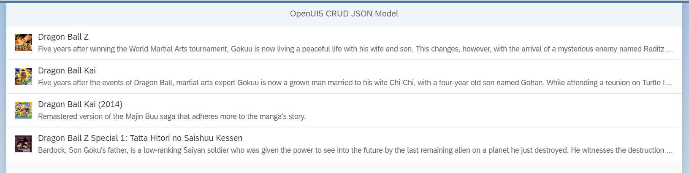

# openui5-model-json-crud

[](https://www.npmjs.com/package/openui5-model-json-crud) [](https://github.com/mauriciolauffer/openui5-model-json-crud/actions/workflows/test.yml)

An OpenUI5 library which extends JSONModel to support CRUD (Create, Read, Update, Delete) operations. It uses fetch (not jQuery.ajax) to send requests to the server and populates a JSON Model with the responses.
As aforementioned, OpenUI5 CRUD JSON Model uses fetch hence it returns Promises.

## Demo

You can check out a live demo here:

<https://mauriciolauffer.github.io/openui5-model-json-crud/demo/webapp/index.html>



## Project Structure

* demo - Library's live demo
* dist - Distribution folder which contains the library ready to use
* src  - Development folder
* test - Testing framework for the library

## Getting started

### Installation

Install openui5-model-json-crud as an npm module

```sh
$ npm install openui5-model-json-crud
```

### Configure manifest.json

Add the library to *sap.ui5/dependencies/libs* and set its path in *sap.ui5/resourceRoots* in your manifest.json file, as follows:

```json
{
  "sap.ui5": {
    "dependencies": {
      "libs": {
        "openui5.model.json.crud": {}
      }
    },
    "resourceRoots": {
      "openui5.model.json.crud": "./FOLDER_WHERE_YOU_PLACED_THE_LIBRARY/openui5/model/json/crud/"
    }
  }
}
```

### How to use

Import openui5-model-json-crud to your UI5 controller using *sap.ui.define* or *sap.ui.require*:

```javascript
sap.ui.require([
  'openui5/model/json/crud/CRUDModel'
], function(CRUDModel) {
  const serviceUrl = 'https://api.jikan.moe/v3/'; //backend root URL
  const crudModel = new CRUDModel(serviceUrl);
  this.getView().setModel(crudModel, 'CRUDModel');
  //'search/anime?q=DBZ' is the path to the service to be called, it'll be concatenated to serviceUrl
  //'/DBZ' is the path to the property into the model, in case you want to updated the model with the response;
  // empty value does not update the local model, it only returns the response
  crudModel.read('search/anime?q=DBZ', '/DBZ')
    .then(function() {
      console.log('Data selected from API');
    })
    .catch(function(err) {
      console.error(err.toString());
    });
});
```

## Author

Mauricio Lauffer

* LinkedIn: [https://www.linkedin.com/in/mauriciolauffer](https://www.linkedin.com/in/mauriciolauffer)

## License

This project is licensed under the MIT License - see the [LICENSE](LICENSE) file for details
